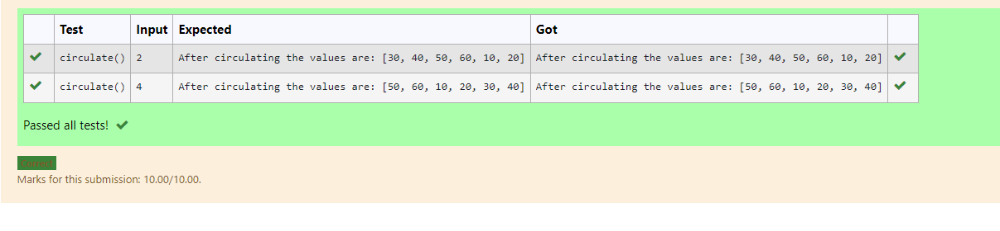

# Circulate-the-values-of-N-variables
## Aim:
To write a python program to circulate the n variables using function concept
## Equipment’s required:
PC
Anaconda - Python 3.7
## Algorithm: 
### Step 1: start the program with the function statement
### Step 2: get the input from the user 
### Step 3:Get the value from the user for the number of rotation
### Step 4:Using the slicing concept rotate the list 
### Step 5:using the step4 we can circulate the numbers 
### Step 6: print after circulating the values.
## Program:
def circulate():
    l=[10,20,30,40,50,60]
    n=int(input())
    l=l[n:]+l[:n]
    print("After circulating the values are:",l)

## Output:

## Result:
thus the program executed successfully.